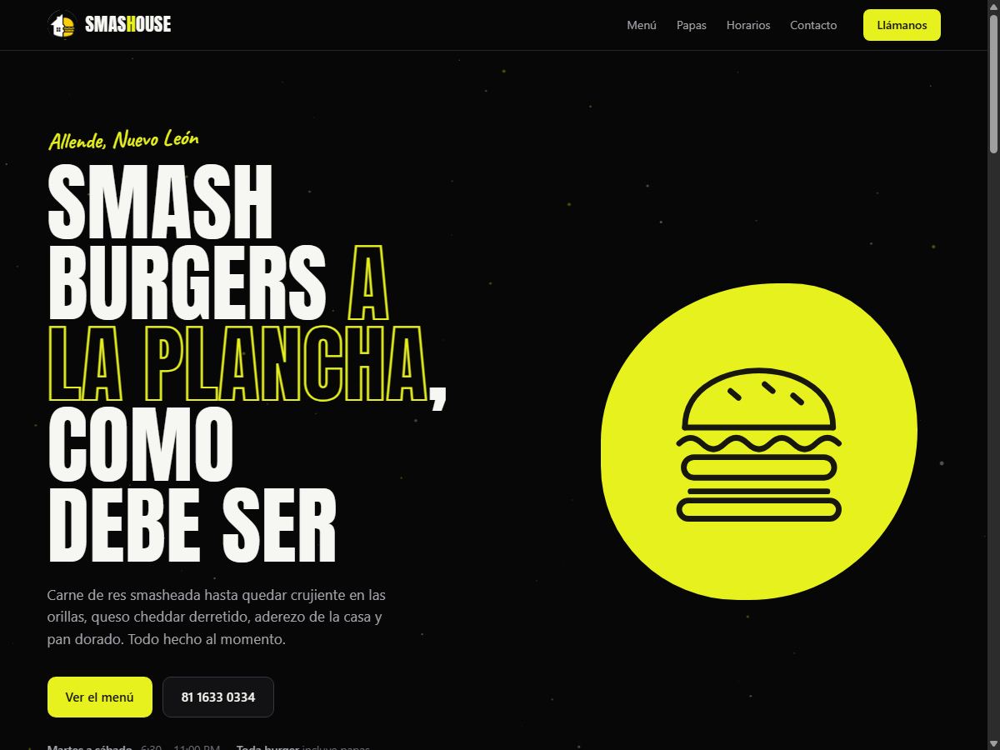
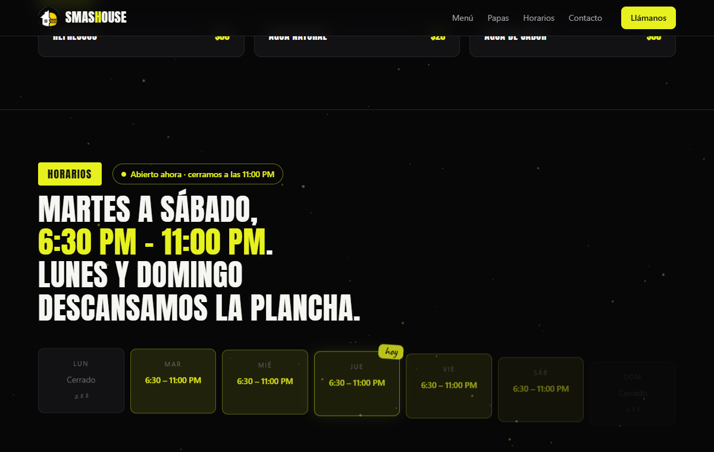

# 🍔 Smashouse — Landing Page

**Smash burgers a la plancha, como debe ser.** Landing page for [Smashouse](https://www.instagram.com/smashouse) — Allende, Nuevo León, México.

One file. Zero dependencies. No build step. The entire site — fonts, photos, logo, animations — ships as a single self-contained `index.html` that works offline and can be dropped onto any static host (GitHub Pages, Netlify, a USB stick) as-is.



## ✨ What's inside

| | |
|---|---|
| 🌌 **Particle field** | ~90 volt-yellow specks drift on a canvas behind the page, each with its own depth — scrolling moves them at different speeds for a parallax "flying through" feel |
| 🫧 **Living hero blob** | The hero shape morphs organically and bobs; the burger doodle inside rotates as you scroll |
| 🎬 **Scroll reveals** | Menu cards, prices, and sections cascade in with staggered timing as they enter the viewport |
| 🕐 **Live "Abierto ahora"** | The Horarios section reads the visitor's clock: a pulsing status pill says whether the grill is on right now — or exactly when it fires up next ("abrimos hoy / mañana / el martes a las 6:30 PM"). Re-checks itself every minute |
| ✍️ **"hoy" sticker** | Today's card in the week grid gets a hand-scripted tag and a volt glow — moves itself at midnight, forever |
| 😴 **z z z** | Closed days sleep, because *lunes y domingo descansamos la plancha* |
| 📱 **Mobile-first checked** | Audited at real phone viewports — no horizontal overflow, retina-crisp canvas, tightened rhythm under 720px |
| ♿ **Reduced motion** | Every animation respects `prefers-reduced-motion` — those users get the clean static page |

<p align="center">
  
</p>

## 🚀 Run it

There is nothing to install:

```
open index.html          # that's it. that's the build.
```

## 🎨 Design system

Dark canvas with a single loud accent, inspired by Linear's restraint — then smashed with the brand:

| Token | Value | Role |
|---|---|---|
| `--canvas` | `#070708` | near-black backdrop |
| `--volt` | `#e7f11e` | the yellow that does all the yelling |
| `--paper` | `#f2f0e8` | hand-written price stickers |
| Display | **Anton** | condensed all-caps headlines |
| Hand | **Caveat** | prices & margin notes, like the physical menu |

Both fonts are subset and embedded as data URIs — no external requests, no FOUT.

## 📁 Contents

```
index.html            ← the whole site (≈700 KB, everything embedded)
assets/               ← source images kept for future edits
  logo-full.png         mark + script wordmark
  logo-mark.png         circular mark (nav / footer)
  smash.jpg · oklahoma.jpg · crispy.jpg · plancha.jpg
docs/                 ← README previews
```

## 🍟 Menu highlights

Smash Burger `$140/$175` · Oklahoma `$135/$170` · Crispy Onion Bacon `$150/$190` · Chicken `$145/$185` — **todas con papas incluidas**.

Martes a sábado · 6:30 – 11:00 PM · 📞 [81 1633 0334](tel:+528116330334)

## 📝 Pending

- [ ] Chicken Burger photo (card shows a hand-drawn "foto pendiente" placeholder)
- [ ] Confirm Instagram handle (@smashouse assumed)

---

<sub>Scroll animation concepts adapted from the classic <a href="https://github.com/justanotherdeveloperjoe/threejs-scroll-animation-demo">three.js scroll demo</a> — rebuilt in ~120 lines of vanilla JS/CSS, no three.js required.</sub>
